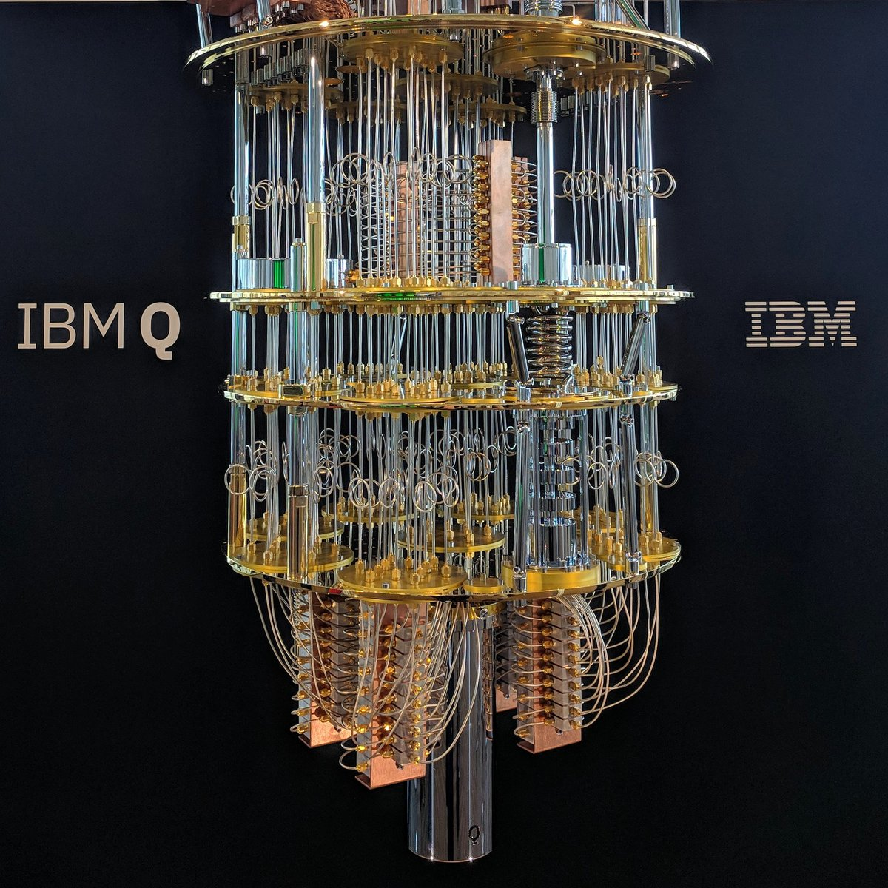

# Introduction

## _Ce n'est pas un lustre_ (This is not a Chandelier)

::: notes

- What the hell is QC?
- What have you heard about it so far?
- What do you know about QC?

:::

## Big big picture

::: incremental

- New computing paradigm

- Uses the rules of quantum mechanics

- __Might__ be able to solve __some__ problems exponentially faster

- __Definitely__ could simulate quantum systems better

- Realizable in large scale?

- $\text{¯\reflectbox{/}\string_(\text \shrug)\string_/¯}$

:::

::: notes

5 years old

Calculates things in a totally different way from how your computer does

with QC we have different rules (spin a coin sideways)

motivation - simulating nature (discover new things)

15 years old

computer runs out of space

Quantum mechanics is a theory ...

superposition - what is a penny at WHILE ITS SPINNING 

entanglement - measure the pennies at the same time

undergrad

interference - amplify signlas towards the right answer and reduce signals 
towards the wrong answer

grad student (cs)

quantum decoherence

:::

# The Technical Part

## 

\epigraph{``Shut up and calculate''}{David Mermin}

## Overview

- Representing computation with linear algebra

- Qubits, superposition and quantum logic gates

- Simplest problem where a quantum computer outperforms a classical one

- Bonus: Quantum entanglement and quantum teleportation

## Representing classical bits as vectors

One bit with value $0$, also written as $\ket{0}$ (Dirac vector notation)

\qquad $\zero$

One bit with value $1$, also written as $\ket{1}$

\qquad $\one$

## Review: matrix multiplication

:::::: {.columns}
::: {.column width="60%"}

\scalebox{0.8}{
$\pmat{a & b \\ c & d}\pmat{x\\y} = \pmat{ax + by \\ cx + dy}$}

\ 

\ 

\scalebox{0.8}{$\pmat{a & b & c\\ d & e & f \\ g & h & i} \pmat{x\\y\\z} = 
\pmat{ax + by + cz \\ dx + ey + fz \\ gx + hy + iz}$}

\ 

\ 

\scalebox{0.8}{$\pmat{a & b \\ c & d}\pmat{w & x \\ y & z} = \pmat{aw + by & ax 
+ bz \\ cw + dy & cx + dz}$}

:::

::: {.column width="40%"}

\scalebox{0.8}{$\pmat{1 & 0 & 0 & 0 \\ 0 & 1 & 0 & 0 \\ 0 & 0 & 1 & 0 \\ 0 & 0 
& 0 & 1} \pmat{a \\ b \\ c \\ d} = \pmat{a \\ b \\ c \\ d}$}

\ 

\ 

\scalebox{0.8}{$\pmat{1 & 0 & 0 & 0 \\ 0 & 0 & 1 & 0 \\ 0 & 1 & 0 & 0 \\ 0 & 0 
& 0 & 1} \pmat{0 \\ 1 \\ 0 \\ 0} = \pmat{0 \\ 0 \\ 1 \\ 0}$}

:::
:::::: 

## Operations on one classical bit (cbit)

\begin{tabular}{l c c c}
Identity & $f(x) = x$ & \scalebox{0.6}{$\pmat{1 & 0 \\ 0 & 1}\pmat{1 \\ 
0}=\pmat{1 \\ 0}$} & \scalebox{0.6}{$\pmat{1 & 0 \\ 0 & 1}\pmat{0 \\ 1}= 
\pmat{0 \\ 1}$} \\ \\

Negation & $f(x) = \neg x$ & \scalebox{0.6}{$\pmat{0 & 1 \\ 1 & 0}\pmat{1 \\ 
0}=\pmat{0 \\ 1}$} & \scalebox{0.6}{$\pmat{0 & 1 \\ 1 & 0}\pmat{0 \\ 1}= 
\pmat{1 \\ 0}$} \\ \\

Constant-0 & $f(x) = 0$ & \scalebox{0.6}{$\pmat{1 & 1 \\ 0 & 0}\pmat{1 \\ 
0}=\pmat{1 \\ 0}$} & \scalebox{0.6}{$\pmat{1 & 1 \\ 0 & 0}\pmat{0 \\ 1}= 
\pmat{1 \\ 0}$} \\ \\

Constant-1 & $f(x) = 1$ & \scalebox{0.6}{$\pmat{0 & 0 \\ 1 & 1}\pmat{1 \\ 
0}=\pmat{0 \\ 1}$} & \scalebox{0.6}{$\pmat{0 & 0 \\ 1 & 1}\pmat{0 \\ 1}= 
\pmat{0 \\ 1}$} \\
\end{tabular}

## Reversible computing

::: {.incremental}
- Given the operation and the input, you can always infer the output.
   - For $Ax = b$, given $b$ and $A$, you can uniquely find $x$.

\ 

- Permutations are reversible; erasing and overwriting are not
   - Identity and negation are reversible.
   - Constant-0 and Constant-1 are not reversible.

\ 

- Quantum computers only use reversible operations.
   - In fact, all quantum operations are their own inverse.

:::

## Review: tensor product of vectors

::::: {.columns}
::: {.column width="50%"}

\scalebox{0.7}{$\pmat{x_0 \\ x_1}\otimes\pmat{y_0\\y_1}= 
\pmat{x_0\pmat{y_0\\y_1} \\ x_1\pmat{y_0\\y_1}} = \pmat{x_0y_0\\x_0y_1 \\ 
x_1y_0\\x_1y_1}$}

\ 

\ 

\scalebox{0.7}{$\pmat{x_0\\x_1}\otimes \pmat{y_0\\y_1}\otimes \pmat{z_0\\z_1} = 
\pmat{x_0y_0z_0\\ x_0y_0z_1\\ x_0y_1z_0 \\ x_0y_1z_1 \\ x_1y_0z_0 \\ x_1y_0z_1 
\\ x_1y_1z_0 \\ x_1y_1z_1}$}
:::

::: {.column width="50%"}

\scalebox{0.8}{$\pmat{1\\2}\otimes\pmat{3\\4}= \pmat{3\\4\\6\\8}$}

\ 

\scalebox{0.8}{$\one \otimes \one \otimes \zero = 
\pmat{0\\0\\0\\0\\0\\0\\1\\0}$}
:::
:::::

## Representing multiple cbits

::::: {.columns}

::: {.column width="33%"}
\scalebox{0.7}{$\ket{00} = \zero\otimes\zero = \pmat{1\\0\\0\\0}$}

\ 

\scalebox{0.7}{$\ket{10} = \one\otimes\zero = \pmat{0\\0\\1\\0}$}
:::

::: {.column width="33%"}
\scalebox{0.7}{$\ket{01} = \zero\otimes\one = \pmat{0\\1\\0\\0}$}

\ 

\scalebox{0.7}{$\ket{11} = \one\otimes\one = \pmat{0\\0\\0\\1}$}
:::
::: {.column width="33%"}

\scalebox{0.6}{$\ket{100} = \one\otimes\zero\otimes\zero = 
\pmat{0\\0\\0\\0\\1\\0\\0\\0}$}

:::
:::::

- The tensor representation is called the __product state__.

- It can be __factored__ back into the __individual state__ representation.

- The product state of $n$ bits is a vector of size $2^n$.

## Operations on multiple cbits: CNOT

- Takes two bits, one "control" bit and one"target" bit.

- If the "control" bit is set, flip the "target" bit, otherwise leave it.

- If most significant bit is control, and least-significant is target, then:

. . .

::::: {.columns}

::: {.column width="50%"}

\hspace{30pt}
\begin{tikzpicture}[ampersand replacement=\&]
  \matrix (m) [matrix of math nodes,row sep=.5em,column sep=4em,minimum 
width=2em]
  {
    \ket{00} \& \ket{00} \\
    \ket{01} \& \ket{01} \\
    \ket{10} \& \ket{10} \\
    \ket{11} \& \ket{11} \\
   };

   \uncover<3->{\draw[->] (m-1-1) -- (m-1-2);}
   \uncover<4->{\draw[->] (m-2-1) -- (m-2-2);}
   \uncover<5->{\draw[red,->] (m-3-1) -- (m-4-2);}
   \uncover<6->{\draw[red,->] (m-4-1) -- (m-3-2);}
\end{tikzpicture}

:::

::: {.column width="50%"}

\uncover<7->{
\vspace{10pt}
\scalebox{1.0}{$C = \pmat{1 & 0 & 0 & 0 \\ 0 & 1 & 0 & 0 \\ 0 & 0 & 0 & 1 \\ 0 
& 0 & 1 & 0}$}}
:::
:::::

