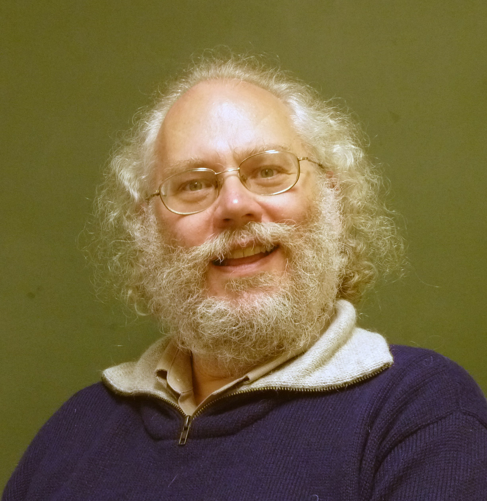

# Introduction

## _Ce n'est pas un lustre_ (This is not a Chandelier)

::: notes

- What the hell is QC?
- What have you heard about it so far?
- What do you know about QC?

:::

## Big big picture

::: incremental

- New computing paradigm

- Uses the rules of quantum mechanics

- \alert{Might} be able to solve \alert{some} problems exponentially faster

- \alert{Definitely} could simulate quantum systems better

- Realizable in large scale?

- $\text{¯\reflectbox{/}\string_(\text \shrug)\string_/¯}$

:::

## Disclaimer

- Quantum Computing is technical

- Quantum Algorithms are hard

- Quantum Mechanics is weird

- Quantum Mechanics is technical

##

\begin{center}
\Huge Examples?
\end{center}

## Example: the RSA algorithm

\begin{center}
\begin{tikzpicture}[ampersand replacement=\&, font=\small]
\uncover<1->{\node[alice,female,minimum size=1.5cm] (A) {Alice};}
\uncover<2->{\node[bob,right=3cm of A,minimum size=1.5cm,mirrored] (B) {Bob};}
\uncover<3-4>{\draw (A.east) edge[->]  node[above] {"Hello Bob"} (B.west);}
\uncover<4>{\node[devil, right of=A,minimum size=1.5cm, below=1cm of A] 
(C){Devil};}
\uncover<5-6>{\draw (B.270) ++ (0, -1.0) node {\makecell{Generate 
Public/Private keys\\$e$, $d$, $N=pq$}};}
\uncover<6>{\draw (A.east) edge[<-]  node[above] {"Public Key: $e$, $N$"} 
(B.west);}
\uncover<7->{\draw (A.270) ++(0, -1.0) node 
{\makecell{$m=\mathrm{encode}(\text{"Hello World"})$\\$c = m^e\mod{N}$}};}
\uncover<8->{\draw (A.east) edge[->] node[above] {$c$} (B.west);}
\uncover<9->{\draw (B.270) ++(0, -1.0) node {\makecell{$m = 
c^d\mod{N}$\\$\mathrm{decode}(m)$}} ;}
\end{tikzpicture}
\end{center}

## Example: the RSA algorithm - outline

It's \alert{easy} to find $e, d, N \in \mathbb{N}$, such that:

. . .

\begin{equation*}
\boxed{(m^e)^d \equiv m \Mod{N}}
\end{equation*}

. . .

::: incremental

- $N = pq$ with $p$, $q$ large prime numbers.

- $e$, $N$ - Public Key

- $d$, $N$ - Private Key

:::

. . .

But it's \alert{hard} to find $p$, $q$, such that $pq = N$.

## Example: the RSA algorithm - Factorizing is Hard

### Factorizing on a Classical Computer

\vspace{1em}

\begin{tabular}{clp{5cm}}
\alert{Bits} & \alert{Time} & {\textcolor{mLightBrown}{Notes}}\\ \hline
128 & less than 2 seconds \\
192 & 16 seconds \\
256 & 35 minutes \\
260 & 1 hour \\
512 & 73 days & in 2009\\
\uncover<2->{
\alert{768} & \alert{1500 CPU years} & {\textcolor{mLightBrown}{Largest known 
(2010), took 2 years on hundreds of computers}}}
\end{tabular}

\vspace{1em}
\uncover<3->{Most RSA implementations use between \alert{1024} and \alert{4096} 
bits.}

## Example: the RSA algorithm - Shor's Algorithm

## Example: the RSA algorithm - Shor's Algorithm

\begin{center}
\includegraphics[height=0.8\textheight]{images/peter_w_shor.jpg}
\end{center}

Would require $\sim 4000$ qubits to break $2048$-bit RSA

## Basics of Quantum Mechanics (simplified)

::: incremental

- The system is in a state ($\psi(t) = \ket{\psi}$).

- The state can be a superposition of \alert{measureable} states (e.g. 
  $\ket{\psi} = \alpha\ket{0} + \beta\ket{1}$).

\only<2>{
\begin{center}
\begin{tikzpicture}
    \draw [<->] (0,2) -- (0, 0) -- (2, 0);
    \node at (2, -0.3) {$\ket{0}$};
    \node at (-0.3, 2) {$\ket{1}$};
    \draw [->,thick] (0, 0) -- (45:1);
    \draw [->,thick] (0, 0) -- (0, 1);
    \draw [->,thick] (0, 0) -- (1, 0);
    \node[anchor=south west] at (70:0.8) {\scalebox{0.7}{ 
        $\ket{\psi}=\frac{1}{\sqrt{2}}(\ket{0}+\ket{1})$}};
\end{tikzpicture}
\end{center}
}

- The time evolution of the state is \alert{reversible}.

- When you measure the system, the result is probabilistic (e.g. probability of 
  measuring $0$ is $\alpha^2$ and $1$ is $\beta^2$).

- After the measurement, the state \alert{collapses} to the measured outcome 
  ($\ket{0}$ or $\ket{1}$).

- It is impossible to clone the state of the system (no-cloning theorem).

:::

# Movie

# The Technical Part

## 

\epigraph{``Shut up and calculate''}{David Mermin}

## Overview

- Representing computation with linear algebra

- Qubits, superposition and quantum logic gates

- Simplest problem where a quantum computer outperforms a classical one

- Bonus: Quantum entanglement and quantum teleportation

## Representing classical bits as vectors

One bit with value $0$, also written as $\ket{0}$ (Dirac vector notation)

\qquad $\zero$

\ 

\ 

One bit with value $1$, also written as $\ket{1}$

\qquad $\one$

## Review: matrix multiplication

:::::: {.columns}
::: {.column width="60%"}

\scalebox{0.8}{
$\pmat{a & b \\ c & d}\pmat{x\\y} = \pmat{ax + by \\ cx + dy}$}

\ 

\ 

\scalebox{0.8}{$\pmat{a & b & c\\ d & e & f \\ g & h & i} \pmat{x\\y\\z} = 
\pmat{ax + by + cz \\ dx + ey + fz \\ gx + hy + iz}$}

\ 

\ 

\scalebox{0.8}{$\pmat{a & b \\ c & d}\pmat{w & x \\ y & z} = \pmat{aw + by & ax 
+ bz \\ cw + dy & cx + dz}$}

:::

::: {.column width="40%"}

\scalebox{0.8}{$\pmat{1 & 0 & 0 & 0 \\ 0 & 1 & 0 & 0 \\ 0 & 0 & 1 & 0 \\ 0 & 0 
& 0 & 1} \pmat{a \\ b \\ c \\ d} = \pmat{a \\ b \\ c \\ d}$}

\ 

\ 

\scalebox{0.8}{$\pmat{1 & 0 & 0 & 0 \\ 0 & 0 & 1 & 0 \\ 0 & 1 & 0 & 0 \\ 0 & 0 
& 0 & 1} \pmat{0 \\ 1 \\ 0 \\ 0} = \pmat{0 \\ 0 \\ 1 \\ 0}$}

:::
:::::: 

## Operations on one classical bit (cbit)

\begin{tabular}{l c c c}
Identity & $f(x) = x$ & \scalebox{0.6}{$\pmat{1 & 0 \\ 0 & 1}\pmat{1 \\ 
0}=\pmat{1 \\ 0}$} & \scalebox{0.6}{$\pmat{1 & 0 \\ 0 & 1}\pmat{0 \\ 1}= 
\pmat{0 \\ 1}$} \\ \\

Negation & $f(x) = \neg x$ & \scalebox{0.6}{$\pmat{0 & 1 \\ 1 & 0}\pmat{1 \\ 
0}=\pmat{0 \\ 1}$} & \scalebox{0.6}{$\pmat{0 & 1 \\ 1 & 0}\pmat{0 \\ 1}= 
\pmat{1 \\ 0}$} \\ \\

Constant-0 & $f(x) = 0$ & \scalebox{0.6}{$\pmat{1 & 1 \\ 0 & 0}\pmat{1 \\ 
0}=\pmat{1 \\ 0}$} & \scalebox{0.6}{$\pmat{1 & 1 \\ 0 & 0}\pmat{0 \\ 1}= 
\pmat{1 \\ 0}$} \\ \\

Constant-1 & $f(x) = 1$ & \scalebox{0.6}{$\pmat{0 & 0 \\ 1 & 1}\pmat{1 \\ 
0}=\pmat{0 \\ 1}$} & \scalebox{0.6}{$\pmat{0 & 0 \\ 1 & 1}\pmat{0 \\ 1}= 
\pmat{0 \\ 1}$} \\
\end{tabular}

## Reversible computing

- Given the operation and the input, you can always infer the output.
   - For $Ax = b$, given $b$ and $A$, you can uniquely find $x$.

. . .

- Permutations are reversible; erasing and overwriting are not
   - Identity and negation are reversible.
   - Constant-0 and Constant-1 are not reversible.

. . .

- Quantum computers use \alert{only reversible operations}.
   - In fact, all quantum operations are their own inverse.

## Review: tensor product of vectors

::::: {.columns}
::: {.column width="50%"}

\scalebox{0.7}{$\pmat{x_0 \\ x_1}\otimes\pmat{y_0\\y_1}= 
\pmat{x_0\pmat{y_0\\y_1} \\ x_1\pmat{y_0\\y_1}} = \pmat{x_0y_0\\x_0y_1 \\ 
x_1y_0\\x_1y_1}$}

\ 

\ 

\scalebox{0.7}{$\pmat{x_0\\x_1}\otimes \pmat{y_0\\y_1}\otimes \pmat{z_0\\z_1} = 
\pmat{x_0y_0z_0\\ x_0y_0z_1\\ x_0y_1z_0 \\ x_0y_1z_1 \\ x_1y_0z_0 \\ x_1y_0z_1 
\\ x_1y_1z_0 \\ x_1y_1z_1}$}
:::

::: {.column width="50%"}

\scalebox{0.8}{$\pmat{1\\2}\otimes\pmat{3\\4}= \pmat{3\\4\\6\\8}$}

\ 

\scalebox{0.8}{$\one \otimes \one \otimes \zero = 
\pmat{0\\0\\0\\0\\0\\0\\1\\0}$}
:::
:::::

## Representing multiple cbits

::::: {.columns}

::: {.column width="33%"}
\scalebox{0.7}{$\ket{00} = \zero\otimes\zero = \pmat{1\\0\\0\\0}$}

\ 

\scalebox{0.7}{$\ket{10} = \one\otimes\zero = \pmat{0\\0\\1\\0}$}
:::

::: {.column width="33%"}
\scalebox{0.7}{$\ket{01} = \zero\otimes\one = \pmat{0\\1\\0\\0}$}

\ 

\scalebox{0.7}{$\ket{11} = \one\otimes\one = \pmat{0\\0\\0\\1}$}
:::
::: {.column width="33%"}

\scalebox{0.6}{$\ket{100} = \one\otimes\zero\otimes\zero = 
\pmat{0\\0\\0\\0\\1\\0\\0\\0}$}

:::
:::::

- The tensor representation is called the \alert{product state}.

- It can be \alert{factored} back into the \alert{individual state} 
  representation.

- The product state of $n$ bits is a vector of size $2^n$.

## Operations on multiple cbits: CNOT 

- Takes two bits, one \alert{control} bit and one \alert{target} bit.

- If the control bit is set, flip the target bit, otherwise leave it.

. . .

- If most significant bit is control, and least-significant is target, then:

::::: {.columns}

::: {.column width="50%"}

\hspace{30pt}
\begin{tikzpicture}[ampersand replacement=\&]
  \matrix (m) [matrix of math nodes,row sep=.5em,column sep=4em,minimum 
width=2em]
  {
    \ket{00} \& \ket{00} \\
    \ket{01} \& \ket{01} \\
    \ket{10} \& \ket{10} \\
    \ket{11} \& \ket{11} \\
   };

   \uncover<3->{\draw[->] (m-1-1) -- (m-1-2);}
   \uncover<4->{\draw[->] (m-2-1) -- (m-2-2);}
   \uncover<5->{\draw[red,->] (m-3-1) -- (m-4-2);}
   \uncover<6->{\draw[red,->] (m-4-1) -- (m-3-2);}
\end{tikzpicture}

:::

::: {.column width="50%"}

\uncover<7->{
\vspace{10pt}
\scalebox{1.0}{$C = \cnot$}}
:::
:::::

## Operations on multiple cbits: CNOT

\scalebox{0.8}{$C\ket{10} = C\left(\one\otimes\zero \right) = \cnot\onezero = 
\oneone = \one\otimes\one = \ket{11}$}

\hspace{30pt}

\scalebox{0.8}{$C\ket{11} = C\left(\one\otimes\one \right) = \cnot\oneone = 
\onezero = \one\otimes\zero = \ket{10}$}

## Operations on multiple cbits: CNOT

\scalebox{0.8}{$C\ket{00} = C\left(\zero\otimes\zero \right) = \cnot\zerozero = 
\zerozero = \zero\otimes\zero = \ket{00}$}

\hspace{30pt}

\scalebox{0.8}{$C\ket{01} = C\left(\zero\otimes\one \right) = \cnot\zeroone = 
\zeroone = \zero\otimes\one = \ket{01}$}

## Qubits and superposition

- Cbits are a special case of Qubits!

- A qubit is represented by \scalebox{0.5}{$\pmat{a \\ b}$} where $a$ and $b$ 
  are \alert{complex numbers} such that $||a||^2 + ||b||^2=1$.

   - The cbit vectors \scalebox{0.5}{$\zero$} and \scalebox{0.5}{$\one$} fit 
     this definition. 

- Example qubit values:

\begin{equation*}
\pmat{\frac{1}{\sqrt{2}}\\{\frac{1}{\sqrt{2}}}} \qquad 
\pmat{\frac{1}{2}\\{\frac{\sqrt{3}}{2}}} \qquad \pmat{-1\\0} \qquad 
\pmat{\frac{1}{\sqrt{2}}\\{\frac{-1}{\sqrt{2}}}}
\end{equation*}

## Qubits and superposition 

### What does that mean?

. . .

\metroset{block=fill}
\begin{block}{Superposition}
The qubit is in a state of both $\ket{0}$ and $\ket{1}$. We can write this as:

\scalebox{0.8}{$\pmat{a\\b} = a\zero + b\one = a\ket{0} + b\ket{1}.$}
\end{block}

. . .

\begin{block}{Amplitudes}
$a$ and $b$ are called amplitudes. $||a||^2$ is the probability of
the qubit being $0$ when \alert{measured}; $||b||^2$ is the probability of
measuring $1$.
\end{block}

. . . 

\begin{block}{Measurement}
The measurement of the qubit \alert{collapses} its state. It will be in the
state $\ket{0}$ if we measured $0$ and $\ket{1}$ if we measured $1^\dagger$.
\end{block}

## Qubits and superposition

\metroset{block=fill}
\begin{exampleblock}{For example}
The qubit \scalebox{0.7}{$\pmat{\sqrtt \\ \sqrtt}$} has a 
$\left|\left|\sqrtt\right|\right|^2 = \frac{1}{2}$ chance of collapsing to 
$\ket{0}$ or $\ket{1}$.

The qubit \scalebox{0.7}{$\zero$} has $100\%$ chance of collapsing to 
$\ket{0}$, and \scalebox{0.7}{$\one$} has a $100\%$ chance of collapsing to 
$\ket{1}$.

\end{exampleblock}

## Qubits and Superposition

- Multiple qubits are represented by the tensor product: 
  \scalebox{0.7}{$\phase{a}{b}\otimes\phase{c}{d}=\pmat{ab\\ad\\bc\\bd}$}
  with $||ac||^2 + ||ad||^2+||bc||^2+||bd||^2=1$.

. . .

- For example:
  \begin{equation*}
  \phase{\sqrtt}{\sqrtt} \otimes \phase{\sqrtt}{\sqrtt} = 
\pmat{\frac{1}{2}\\\frac{1}{2}\\\frac{1}{2}\\\frac{1}{2}} ; \quad  
\left|\left|\frac{1}{2}\right|\right|^2 = \frac{1}{4}; \quad 
\frac{1}{4}+\frac{1}{4}+\frac{1}{4}+\frac{1}{4} = 1
  \end{equation*}

. . .

  $\rightarrow$ There's an equal chance ($25\%$) of measuring $\ket{00}$, 
  $\ket{01}$, $\ket{10}$, $\ket{11}$.

## Operations on qubits

- We operate on qubits in the same way as on cbits: with matrices.

- All the operations we saw so far (bit flip, CNOT, etc...) work on qubits as 
  well.

- In reality, the matrix operations model some device that manipulates the real 
  qubits \alert{without measurement}. 

- Some gates only make sense in the quantum context...

## The Hadamard gate

- The Hadaramd gate puts a $\ket{0}$ or $\ket{1}$ bit into exact
  superposition: $H\ket{0} = \sqrtt\left(\ket{0}+\ket{1}\right)$ and $H\ket{1} 
  = \sqrtt\left(\ket{0}-\ket{1}\right)$.

. . .

\begin{equation*}
H = \pmat{\sqrtt & \sqrtt \\ \sqrtt & -\sqrtt}
\end{equation*}

. . .

- Note that $H^2 = HH = \bf{1}$ so $H^2\ket{0} = \ket{0}$ and $H^2\ket{1} = 
  \ket{1}$.

. . .

- This allows us to get out of superposition without measurement! So we can 
  structure computations deterministically.

